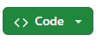
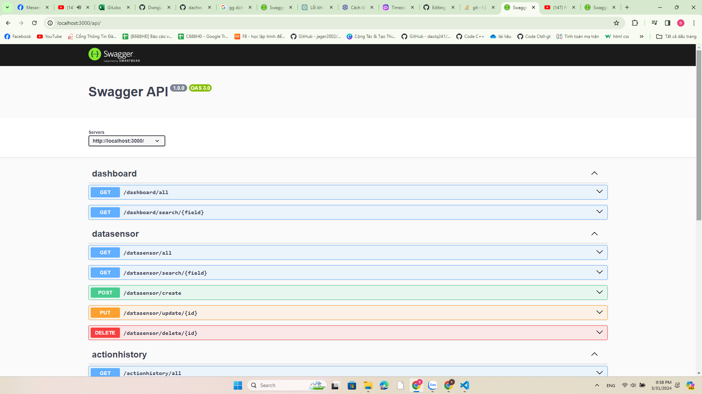

# IOT Project

## Mô tả
IOT Project là một dự án website tích hợp với hệ thống IOT. Hệ thống cho phép người dùng theo dõi các dữ liệu như nhiệt độ, độ ẩm, ánh sáng. Ngoài ra người dùng cũng có thể bật/tắt đèn (quạt).
- **Hardware**: Dự án sử dụng mạch Esp8266 và các cảm biến nhiệt độ, độ ẩm, ánh sáng để thu các dữ liệu từ môi trường. Hệ thống sử dụng MQTT broker để chuyển dữ liệu từ phần cứng đến server, sau đó server xử lý dữ liệu và chuyển lên client để hiển thị.
- **Software**: Dự án sử dụng ReactJS để hiển thị dữ liệu bên client và NodeJS (ExpressJS) để xử lý dữ liệu ở server. Về hành động bật/tắt đèn (quạt) thì người dùng sẽ tương tác để thực hiện yêu cầu bật/tắt trên giao diện website(client) sau đó yêu cầu gọi đến server. Ở server thực hiện kết nối đến Mqtt broker để tác động lên phần cứng (bật/tắt ở phần cứng). Sau khi phần cứng thực thi hành động sẽ trả về trạng thái thiết bị cho server từ đó server lại gửi lại trạng thái bật/tắt cho client để hiển thị lên giao diện người dùng

## Cách cài đặt
### Bước 1: Clone dự án từ github thông qua 
 
```
git clone https://github.com/trantrungkien02/IOT
```
### Bước 2: Mở dự án và cài đặt các thư viện cần thiết
Install thư viện cho Client
- Cài đặt thư viện ở client bằng cách trỏ đến thư mục
```
cd Client
```
- Sau khi đã ở Client thì thực hiện lệnh
```
npm install
```
- Hệ thống sẽ tự động tải xuống các thư viện cần thiết ở **package.json**

Install thư viện cho Server
- Cài đặt thư viện ở server bằng cách trỏ đến thư mục
```
cd Server
```
- Sau khi đã ở Server thì thực hiện lệnh
```
npm install
```
- Hệ thống sẽ tự động tải xuống các thư viện cần thiết ở **package.json**

### Bước 3: Sửa lại kết nối đến database(My SQL)
Sửa file kết nối đến database nằm trong Server/src/config.
Ví dụ:
```
const connection = await createConnection({
      host: 'localhost',
      user: 'root',
      password: 'your password',
      database: 'your database',
    });
```
### Bước 4: Chạy dự án
Chúng ta sẽ chạy Client và Server riêng lẻ

Chạy Client
- Chạy client bằng cách trỏ đến thư mục ```cd Client```
- Sau khi đã ở Client thì thực hiện lệnh
```
npm start
```
- Client được chạy và giao diện website hiển thị

Chạy Server
- Chạy server bằng cách trỏ đến thư mục ```cd Server```
- Sau khi đã ở Server thì thực hiện lệnh
```
npm start
```
- Server sẽ khởi chạy
- Truy cập `http://localhost:3000/api/` để xem apidocs
- Giao diện hiển thị



### Lưu ý
Để dự án chạy thành công và hoạt động thì máy tính của bạn phải được cài sẵn NodeJS,MQTT broker,Ardunio,...Ngoài ra hãy đọc thêm tài liệu về [Swagger](https://swagger.io/docs/) để hiểu rõ hơn về apidocs
Về lắp đặt và thử nghiệm phần cứng, bạn có thể tham khảo [NodeMCU & MQTT](https://www.youtube.com/watch?v=oopbxQnHcHM)


